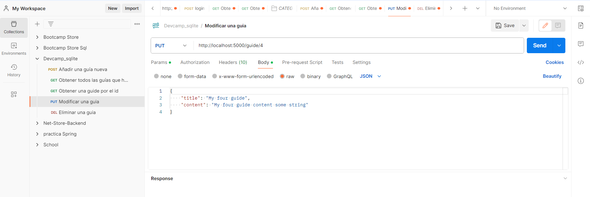

# Documentación Sección Python, MongoDB y Postman


## ¿Para qué usamos Clases en Python?

Las clases en Python se utilizan para crear objetos que tienen propiedades y métodos específicos. Permiten organizar y estructurar el código de manera más eficiente, promoviendo la reutilización y la modularidad del código.

Ejemplo de una clase en Python:

```
class Calculadora:
    """
    Clase que representa una calculadora básica.

    Attributes:
    -----------
    numero1 : float
        El primer número para realizar operaciones.
    numero2 : float
        El segundo número para realizar operaciones.

    Methods:
    --------
    sumar()
        Retorna la suma de los dos números.
    restar()
        Retorna la resta de los dos números.
    multiplicar()
        Retorna la multiplicación de los dos números.
    dividir()
        Retorna la división de los dos números.
    """

    def __init__(self, numero1, numero2):
        """
        Inicializa la calculadora con dos números.

        Parameters:
        -----------
        numero1 : float
            El primer número.
        numero2 : float
            El segundo número.
        """
        self.numero1 = numero1
        self.numero2 = numero2

    def sumar(self):
        """
        Retorna la suma de los dos números.
        """
        return self.numero1 + self.numero2

    def restar(self):
        """
        Retorna la resta de los dos números.
        """
        return self.numero1 - self.numero2

    def multiplicar(self):
        """
        Retorna la multiplicación de los dos números.
        """
        return self.numero1 * self.numero2

    def dividir(self):
        """
        Retorna la división de los dos números.
        Si el segundo número es 0, se levanta una excepción ZeroDivisionError.
        """
        if self.numero2 == 0:
            raise ZeroDivisionError("No se puede dividir por cero.")
        return self.numero1 / self.numero2

```


## ¿Qué método se ejecuta automáticamente cuando se crea una instancia de una clase?

El método que se ejecuta automáticamente cuando se crea una instancia de una clase en Python es el método `__init__()`. Este método se utiliza para inicializar los atributos de la clase y puede aceptar argumentos para configurar el estado inicial del objeto.

```

class MiClase:
    def __init__(self, parametro):
        self.parametro = parametro

instancia = MiClase("Hola")

```


## ¿Cuáles son los tres verbos de API?

Los "verbos" son los diferentes métodos HTTP que se utilizan para interartuar con la base de datos y sus recursos. Son la base de la comunicación entre cliente y servidor. Le indican al servidor lo que el cliente desea realizar en cada solicitud. Una consulta para recuperar datos, insertar nuevos registros, modificar o eliminar registros existentes. 

Los tres verbos principales de una API son:

* __GET__: Se utiliza para solicitar datos de un recurso específico.
* __POST__: Se utiliza para enviar datos y crear un nuevo recurso en el servidor.
* __DELETE__: Se utiliza para eliminar un recurso específico en el servidor.

Existen otros "verbos" como son __OPTION__, __PATCH__ y  __PUT__. Este últimoque se utilizaría de forma frecuente en la relación cliente-servidor, ya que se modifica los datos existentes en la base de datos.


## ¿Es MongoDB una base de datos SQL o NoSQL?

MongoDB es un gestor de base de datos __NoSQL__. No sigue el modelo relacional de las bases de datos SQL tradicionales, sino que utiliza un modelo de documentos basado en JSON permitiendo almacenar y consultar datos de manera flexible y escalable.

Utiliza como lenguaje de consulta por defecto JavaScript, pero también se puede usar con otros lenguajes como puede ser PHP, Java, C++, Ruby...., instalando los drivers correspondientes.

La principal __diferenciación__ entre MongoDB y las bases de datos SQL radica en su arquitectura y modelo de datos:

#### Modelo de Datos:

__SQL__ (relacional): Las bases de datos SQL siguen un modelo relacional, donde los datos se organizan en tablas con filas y columnas. La estructura de los datos se define mediante un esquema fijo y estricto.

__MongoDB__ (NoSQL - Documental): MongoDB es una base de datos NoSQL que sigue un modelo de datos documental. En MongoDB, los datos se almacenan en documentos JSON (BSON, en realidad) flexibles y anidados, lo que permite una mayor flexibilidad y escalabilidad, ya que no requiere un esquema predefinido y puede adaptarse fácilmente a cambios en los datos.

#### Lenguaje de Consulta:

__SQL__: Las bases de datos SQL utilizan SQL como lenguaje de consulta para manipular y recuperar datos. SQL es un estándar ampliamente aceptado y utilizado en la industria.

__MongoDB__: MongoDB utiliza un lenguaje de consulta orientado a documentos, que es similar a la manipulación de objetos JSON. Esto permite realizar consultas y operaciones sobre documentos de manera más natural y flexible.

#### Escalabilidad y Flexibilidad:

__SQL__: Las bases de datos SQL suelen ser menos flexibles en términos de escalabilidad y estructura de datos. Agregar nuevas columnas o cambiar el esquema de una tabla existente puede requerir cambios significativos en la base de datos y puede ser complicado en entornos de alta concurrencia.

__MongoDB__: MongoDB ofrece una mayor flexibilidad y escalabilidad. Puede manejar datos no estructurados y semiestructurados de manera más eficiente y permite escalar horizontalmente con mayor facilidad al distribuir datos a través de múltiples servidores.

#### Transacciones y Consistencia:

__SQL__: Las bases de datos SQL suelen ser más estrictas en cuanto a la integridad de los datos y la consistencia transaccional. Soportan transacciones ACID (Atomicidad, Consistencia, Aislamiento y Durabilidad), lo que garantiza la integridad de los datos incluso en condiciones de fallo del sistema.

__MongoDB__: MongoDB proporciona cierto nivel de consistencia y soporta operaciones atómicas en documentos individuales. Sin embargo, no garantiza la misma consistencia transaccional ACID que las bases de datos SQL. En su lugar, ofrece un enfoque más flexible con opciones como la consistencia eventual.

En resumen, mientras que las bases de datos SQL son ideales para aplicaciones con estructuras de datos fijas y relaciones complejas, MongoDB es más adecuado para aplicaciones que requieren escalabilidad horizontal, flexibilidad en el esquema de datos y operaciones de base de datos de alto rendimiento. La elección entre MongoDB y SQL depende de los requisitos específicos de tu aplicación y las características que más valoras en una base de datos.


## ¿Qué es una API?

Una API define cómo interactuar con un sistema informático para realizar ciertas operaciones o acceder a sus funciones y datos. Es decir, actúa como un intermediario que permite que diferentes sistemas y aplicaciones se comuniquen y trabajen juntos de manera efectiva, facilitando la interoperabilidad y la integración entre sistemas informáticos diversos.

Las APIs pueden tomar diferentes formas y pueden ser utilizadas para diversos propósitos. Algunos tipos comunes de APIs incluyen:

__APIs web:__ Estas son interfaces que permiten que aplicaciones y servicios web interactúen entre sí a través de Internet. Las APIs web pueden proporcionar acceso a recursos, como bases de datos, servicios de almacenamiento en la nube, sistemas de pago, redes sociales, y más.

__APIs de sistema operativo:__ Estas APIs permiten que los programas accedan y utilicen las funciones del sistema operativo, como el sistema de archivos, la red, los dispositivos de entrada y salida, etc.

__APIs de bibliotecas de software:__ Estas APIs proporcionan funciones y métodos que los programadores pueden utilizar para interactuar con bibliotecas de software específicas. Por ejemplo, las APIs de bibliotecas gráficas permiten a los programadores crear interfaces gráficas de usuario en sus aplicaciones.

Las APIs se basan en estándares y protocolos de comunicación bien definidos, como HTTP para las APIs web, o funciones y estructuras de datos para las APIs de bibliotecas de software. Esto permite que los desarrolladores utilicen las APIs de manera consistente y confiable.

### Un ejemplo de una API sencilla:

___________________________________________________________________________________________________________________________________________________

# Documentación de la API de Usuarios

Esta API proporciona endpoints para administrar usuarios en un sistema.

## Base URL

```
https://api.ejemplo.com

```

## Recursos Disponibles

### Usuarios

Endpoint: `/usuarios`:

Este recurso permite realizar operaciones CRUD (Crear, Leer, Actualizar, Eliminar) sobre usuarios.

+ `GET /usuarios`: Obtiene todos los usuarios registrados.
  
+ `POST /usuarios`: Crea un nuevo usuario.
  
+ `GET /usuarios/{id}`: Obtiene los detalles de un usuario específico.
  
+ `PUT /usuarios/{id}`: Actualiza los detalles de un usuario existente.
  
+ `DELETE /usuarios/{id}`: Elimina un usuario específico.


Parámetros de Consulta:

* `nombre` (opcional): Filtra usuarios por nombre.

Ejemplo de solicitud GET:

```
GET https://api.ejemplo.com/usuarios
```

Respuesta:

```
[
    {
        "id": 1,
        "nombre": "Usuario 1",
        "correo": "usuario1@example.com"
    },
    {
        "id": 2,
        "nombre": "Usuario 2",
        "correo": "usuario2@example.com"
    }
]
```

Ejemplo de solicitud POST:

```
POST https://api.ejemplo.com/usuarios
{
    "nombre": "Nuevo Usuario",
    "correo": "nuevo_usuario@example.com"
}
```

Respuesta:

```
{
    "id": 3,
    "nombre": "Nuevo Usuario",
    "correo": "nuevo_usuario@example.com"
}
```
___________________________________________________________________________________________________________________________________________________


## ¿Qué es Postman?

Plataforma que ayuda en el desarrollo de APIs. Permite a los desarrolladores crear, probar, documentar y compartir APIs de manera eficiente. Postman ofrece una interfaz gráfica fácil de usar que simplifica el proceso de construir y probar peticiones a APIs.

Observando las imagenes de ejemplo podremos ver como, en la parte lateral izquierda, podremos crear todas las APIs que queramos añadiendo los endpoint que necesitemos a cada una de ellas como se puede ver en la primera imagen del endpoint POST, donde se puede ver como la API Devcamp_sqlite tiene en total 5 endpoints Un __POST__ para añadir un documento nuevo, 2 __GET__ de consultas diferentes, una para recuperar todos los registros que hay en la base de datos y el otro para consultar por su id. Un __PUT__, para modificar un documento, por su id y un __DELETE__, para eliminar un documento por su id.

__POST:__


__GET:__


__GET:__


__PUT:__



__DELETE:__


## ¿Qué es el polimorfismo?

El polimorfismo es la capacidad que tienen los objetos de diferentes clases, de responder al mismo método o función de manera diferente. Dicho de otra manera, permite tratar diferentes tipos de objetos de manera uniforme siempre y respondiendo a ciertos métodos o funciones de manera adecuada.

El polimorfismo se puede lograr a través del uso de la herencia y la sobreescritura de métodos. Cuando una clase hija hereda de una clase padre, puede sobrescribir los métodos de la clase padre con una implementación específica para la clase hija.

Un ejemplo de esto último sería:

```
class Animal:
    def hablar(self):
        pass

class Perro(Animal):
    def hablar(self):
        return "Guau!"

class Gato(Animal):
    def hablar(self):
        return "Miau!"

def hacer_hablar(animal):
    return animal.hablar()

# Se crean instancias de las clases guardandolas en una variable llamando a la clase correspondiente:

perro = Perro()
gato = Gato()

# Se llama a la función hacer_hablar con diferentes tipos de animales:
print(hacer_hablar(perro))  # Imprime: Guau!
print(hacer_hablar(gato))   # Imprime: Miau!

```


## ¿Qué es un método dunder?

Un método dunder o double underscore, es un método especial que está rodeado por doble guión bajo tanto al principio como al final de su nombre. Estos métodos también se conocen como "métodos mágicos" o "métodos especiales".  

Los métodos dunder son especiales porque Python los utiliza internamente para realizar diferentes operaciones o proporcionar funcionalidades específicas a los objetos de una clase. Algunos ejemplos comunes de métodos dunder incluyen __init__() para la inicialización de objetos, __str__() para representar el objeto como una cadena, __len__() para obtener la longitud de un objeto, entre otros.

Aquí hay un ejemplo simple que muestra cómo usar algunos métodos dunder en una clase:

```
class mi_clase:
    def __init__(self, nombre):
        self.nombre = nombre
    
    def __str__(self):
        return f'Objeto de MiClase con nombre: {self.nombre}'

    def __len__(self):
        return len(self.nombre)

# Creo una instancia de la clase
objeto = mi_clase('Ejemplo')

# Utilizar los métodos dunder
print(objeto)   # Imprime: Objeto de mi_clase con nombre: Ejemplo
print(len(objeto))  # Imprime: 7

```

En este ejemplo, ```__init__()``` se llama cuando se crea un nuevo objeto de la __clase mi_clase__, ```__str__()``` se llama cuando el objeto se convierte en una cadena, por ejemplo al imprimirlo, y ``` __len__()``` se llama cuando se solicita la longitud del objeto. Estos métodos dunder permiten que los objetos de la clase se comporten de manera más intuitiva y se integren mejor con el resto del código de Python.

Aunque en el video de Jordan dice que sirven como los private o protected de otros lenguajes, por lo que he podido leer no tiene porqué ser así, pero por si acaso lo he querido poner, ya que así lo dice Jordan. Dichos métodos tendrían limitada su visibilidad fuera de la clase en la que se definen si esto fuese así y no es el caso.


## ¿Qué es un decorador de python?

Un decorador en Python es una función que toma otra función como argumento y devuelve una nueva función, generalmente extendiendo o modificando el comportamiento de la función original de alguna manera. Los decoradores proporcionan una buena forma de modificar o extender la funcionalidad de funciones o métodos sin modificar su código.

Los decoradores se utilizan comúnmente en Python para agregar funcionalidades como registro, validación, control de acceso, entre otros, a funciones o métodos existentes.

Aquí hay un ejemplo básico de cómo se ve un decorador en Python:

```
def asegurar_numero_positivo(funcion):
    def wrapper(numero):
        if numero < 0:
            print("Error: El número debe ser positivo.")
            return None
        else:
            return funcion(numero)
    return wrapper

@asegurar_numero_positivo
def calcular_raiz_cuadrada(numero):
    return numero ** 0.5

# Probando la función decorada
print(calcular_raiz_cuadrada(25))  # Imprime: 5.0
print(calcular_raiz_cuadrada(-25))  # Imprime: Error: El número debe ser positivo. None


```
En este ejemplo, definimos un decorador llamado asegurar_numero_positivo que toma una función como argumento y define una función interna llamada wrapper. Esta función wrapper verifica si el número pasado a la función original (calcular_raiz_cuadrada) es positivo. Si lo es, llama a la función original y devuelve su resultado. Si no lo es, imprime un mensaje de error y devuelve None.

Al aplicar el decorador @asegurar_numero_positivo sobre la función calcular_raiz_cuadrada, nos aseguramos de que la función solo reciba números positivos como argumento. Este es un ejemplo simple pero práctico de cómo los decoradores pueden usarse para agregar funcionalidades adicionales a las funciones existentes de manera transparente y sin modificar su lógica interna.

#### Bibliografía:

- Python.org. (s.f.). The Python Tutorial.
- MongoDB Documentation. (s.f.). MongoDB Manual.
- Fielding, R. T. (2000). Architectural Styles and the Design of Network-based Software Architectures. University of California, Irvine.
- Postman Documentation. [https://learning.postman.com/docs](https://learning.postman.com/docs)
- "What is Postman?" por DZone. [https://dzone.com/articles/what-is-postman](https://dzone.com/articles/what-is-postman)
- https://ellibrodepython.com/polimorfismo-en-programacion
- https://ellibrodepython.com/decoradores-python
- https://geekflare.com/es/magic-methods-in-python/
  


#### Nota: Documentación realizada con la extension markdown de Visual Studio Code.

